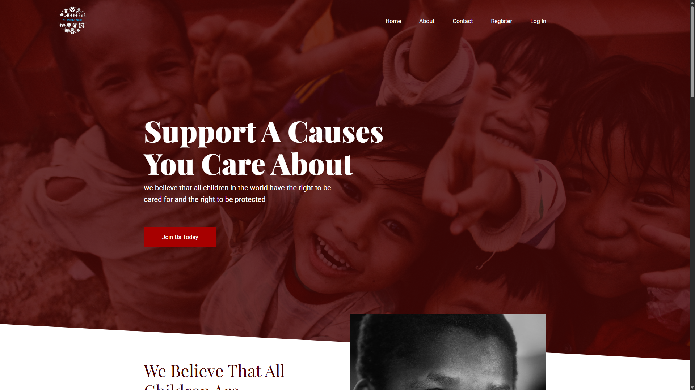
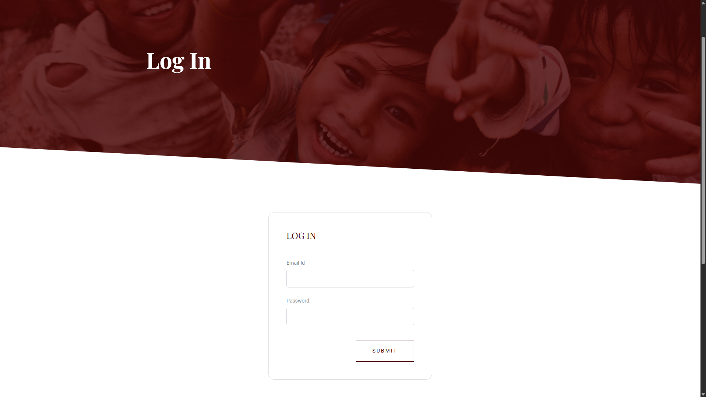
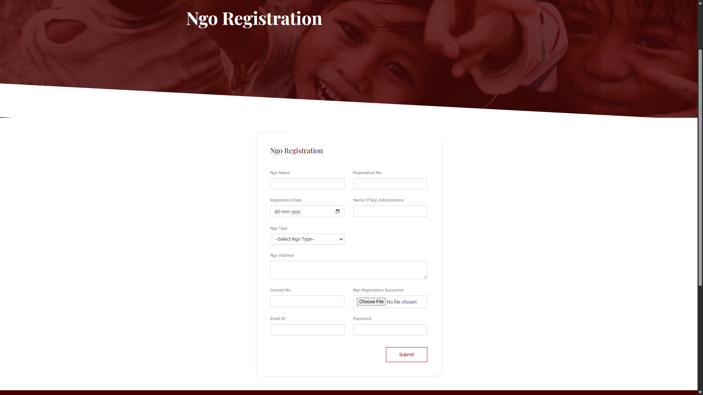
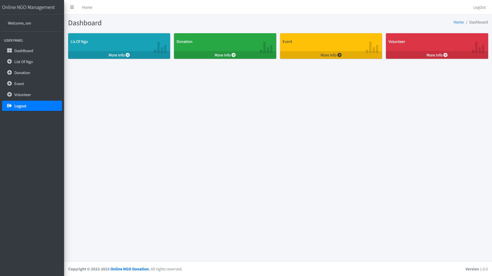
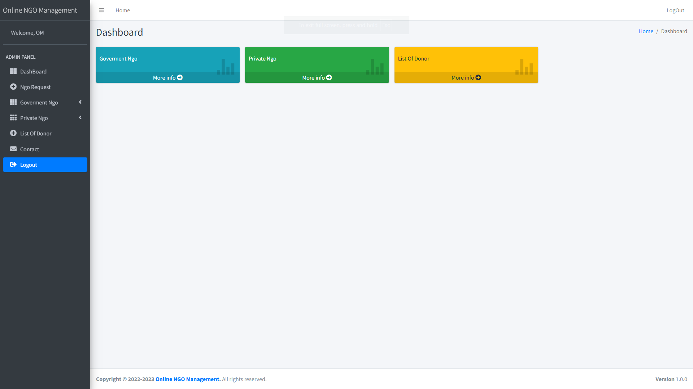

# 🌐 Online NGO Management System

> A centralized web platform for NGO verification, donor management, donation tracking, and administrative oversight — built to bring transparency and accountability to non-profit operations.


---

## 📋 Table of Contents

- [Overview](#-overview)
- [Features](#-features)
- [Technology Stack](#-technology-stack)
- [System Modules](#-system-modules)
- [Project Objectives](#-project-objectives)
- [Installation](#-installation)
- [Screenshots](#-screenshots)
- [Future Enhancements](#-future-enhancements)
- [Author](#-author)
- [License](#-license)

---

## 📌 Overview

The **Online NGO Management System** is a web-based application developed using **ASP.NET Web Forms**, **C#**, and **Microsoft SQL Server**. It provides a centralized platform for:

- ✅ NGO registration and administrator verification
- ✅ Donor registration, login, and donation management
- ✅ Transparent donation tracking and history
- ✅ Volunteer registration management
- ✅ Admin monitoring, reporting, and system control

The system bridges the gap between NGOs and donors by ensuring that only **verified NGOs** can receive donations, improving trust, transparency, and accountability across the board.

---

## ✨ Features

### 🏢 NGO Module
| Feature | Description |
|---|---|
| NGO Registration | NGOs can create and register their organization profile |
| Profile Management | Update and maintain NGO details |
| Verification Request | Submit verification requests to the administrator |
| View Verification Status | Track the current approval status in real time |

### 🙋 Donor Module
| Feature | Description |
|---|---|
| Registration & Login | Secure donor account creation and authentication |
| Profile Management | Manage personal and donation preferences |
| Browse Verified NGOs | Discover and explore administrator-approved NGOs |
| Make Donations | Donate directly to a chosen verified NGO |
| Donation History | View complete record of past donations |

### 🛡️ Admin Module
| Feature | Description |
|---|---|
| Secure Login | Protected administrator access |
| NGO Verification | Review, approve, or reject NGO verification requests |
| Manage NGOs & Donors | Full CRUD control over registered entities |
| Monitor Donations | Track all donation transactions in the system |
| Generate Reports | Export and view system-wide reports |
| System Management | Oversee platform settings and user management |

### 💰 Donation Management
- End-to-end **donation tracking**
- Comprehensive **donation records** management
- **Transaction monitoring** for administrators
- **Full donation history** accessible to donors

### 🔒 Security Features
- User **Authentication** (login/logout)
- **Role-Based Access Control** (Admin / NGO / Donor)
- Secure **Data Management** with validation
- Input **Validation and Verification** across all forms

---

## 🛠️ Technology Stack

| Layer | Technology |
|---|---|
| **Frontend** | ASP.NET Web Forms, HTML, CSS, JavaScript |
| **Backend** | C# (.NET Framework) |
| **Database** | MS SQL Server (SQL Server Management Studio - SSMS) |
| **IDE** | Visual Studio 2022 |
| **Version Control** | Git & GitHub |

---

## 🗂️ System Modules

```text
Online NGO Management System
│
├── 1. NGO Registration and Verification
├── 2. Donor Management
├── 3. Donation Management
├── 4. Volunteer Management
├── 5. Admin Dashboard
└── 6. Reporting and Monitoring
```

---

## 🎯 Project Objectives

- 📂 **Digitize** NGO management processes to eliminate manual paperwork
- 🔍 **Provide transparency** in the donation platform
- ✅ **Enable NGO verification** before accepting any donations
- 🤝 **Improve donor trust** and organizational accountability
- 📉 **Reduce manual record-keeping** through centralized data management

---

## ⚙️ Installation

### Prerequisites

Make sure the following are installed on your system:

- [Visual Studio 2022](https://visualstudio.microsoft.com/)
- [.NET Framework](https://dotnet.microsoft.com/)
- [Microsoft SQL Server](https://www.microsoft.com/en-us/sql-server/sql-server-downloads)
- [SQL Server Management Studio (SSMS)](https://learn.microsoft.com/en-us/sql/ssms/download-sql-server-management-studio-ssms)

### Setup Steps

**1. Clone the repository**
```bash
git clone https://github.com/omspatil/Online-NGO-Management-System.git
```

**2. Open the solution in Visual Studio**
```text
File → Open → Project/Solution → select the .sln file
```

**3. Database Setup via SSMS**
- Open **SQL Server Management Studio (SSMS)** and connect to your local server.
- Open the provided `.sql` database script file from the repository.
- Execute the script to create the `ngo_management` database and required tables.

**4. Update the connection string**

Open `Web.config` and update the connection string to match your SQL Server instance name:
```xml
<connectionStrings>
  <add name="NGOConnectionString"
       connectionString="Data Source=YOUR_SERVER_NAME;Initial Catalog=ngo_management;Integrated Security=True;"
       providerName="System.Data.SqlClient" />
</connectionStrings>
```
*(Note: Replace `YOUR_SERVER_NAME` with your actual SQL Server name, such as `.\SQLEXPRESS` or `localhost`)*

**5. Build and run the project**
```text
Build → Build Solution (Ctrl + Shift + B)
Debug → Start (F5)
```

---

## 📸 Screenshots

### 🏠 Home Page


### 🔑 Login Page


### 📝 NGO Registration


### 📊 Donor Dashboard


### 🛡️ Admin Dashboard


### 💳 Donation Management


---

## 🚀 Future Enhancements

| Enhancement | Description |
|---|---|
| 💳 Online Payment Gateway | Integrate Razorpay / PayPal for real-time online payments |
| 📩 Email & SMS Notifications | Automated alerts for donations, verification status, and updates |
| 📱 Mobile Application | Native Android/iOS companion app |
| 📈 Advanced Analytics Dashboard | Visual charts and metrics for admins and NGOs |
| 📡 Real-Time Donation Tracking | Live donation feeds and progress bars |
| 📋 NGO Performance Reports | Impact reports and outcome summaries per NGO |

---

## 📄 License

This project is developed for **academic and educational purposes** only.

---

> *"Transparency builds trust. Technology enables transparency."*
```
